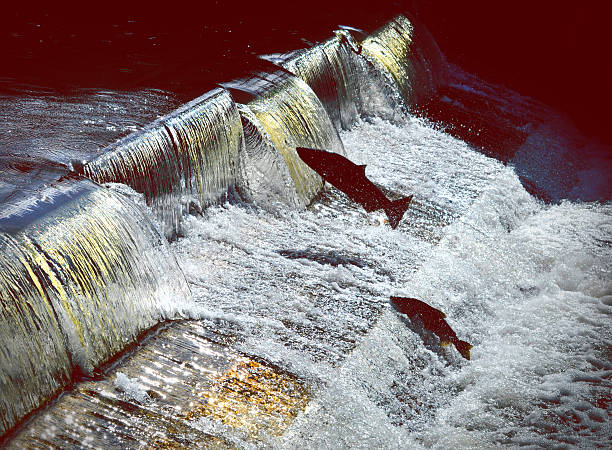
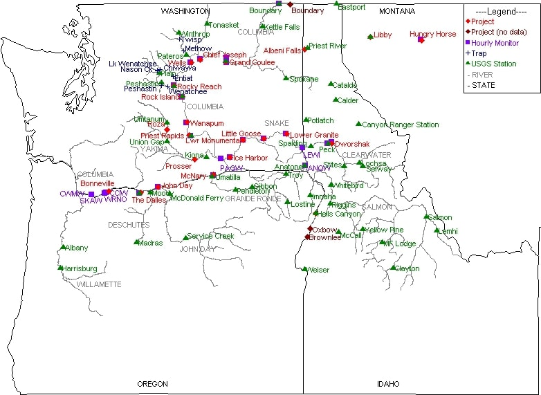

```{r setup, include=FALSE, message = FALSE, warning = FALSE}
knitr::opts_chunk$set(echo = TRUE, message = FALSE, warning = FALSE)

library(tidyverse)
library(here)
library(lubridate)
library(tsibble)
library(feasts)
library(slider)
library(viridis)
library(RColorBrewer)
library(patchwork)
library(knitr)

```


## Summary {.tabset}


In this task, I will be doing a time series analysis on adult fish passage from 2001 to 2011 at Willamette Falls fish ladder on the Willamette River, Oregon. In this document I will show a map of the fish ladder location, two time series analysis of adult passage for coho, jack coho, and steelhead salmon. Lastly, a graph will display the annual total counts of fish passage for the 3 selected species: coho, jack coho, and steelhead. 

```{r, out.width = "400px", fig.cap = "Climbing the Ladder stock photo. Tammy Fullum, istockphoto.com"}

```


```{r, out.width = "400px", fig.cap= "Fish Ladder Locations, (Columbia River DART 2010)"}

```


  

### 2.  Time Series Analysis

```{r}


salmon <- read_csv(here('data/fish/willamette_fish_passage.csv'))

### wrangle the data to create timeseries
salmon_ts <- salmon %>% 
  janitor::clean_names() %>% 
  mutate_all(funs(ifelse(is.na(.), 0, .))) %>% 
  mutate(date = mdy(date)) %>% 
  as_tsibble(key = NULL,
             index = date)

salmon_ts_long <- salmon_ts %>% 
  pivot_longer(c(steelhead, coho, jack_coho),
               names_to = "fish",
               values_to = "count") %>% 
   mutate(fish = case_when(
    fish == 'jack_coho' ~ "Jack Coho",
    fish == 'coho' ~ "Coho",
    fish == 'steelhead' ~ "Steelhead"
  ))

### create the actual plot

ggplot(data = salmon_ts_long,
       aes(x = date,
           y = count)) +
  geom_line(aes(color = fish)) +
  scale_color_manual(values = c("pink2", "purple", "darkblue")) +
  labs(x = 'Year',
       y = 'Amount of Fish',
       color = "Salmon Species",
       caption = "Figure 1. Willamette Falls, Oregon fish ladder use by salmon species from 2001-2010 (Columbia River DART 2010)",
       title = "Willamette Falls Fish Ladder 
       use by Salmon Species") +
  theme_minimal()

```

#### 2.01 Analysis Conclusions
  - Steelhead are the most consistent users of the fish ladder
  - Coho had the largest ladder us in 2010
  - Jack Coho species is the most infrequent user of the fish ladder, or the data had a hard time capturing their usage.


### 3.  Seasonal Analysis

```{r}
### create a finalized seasonplot for each species in its own panel (patchwork)

#steelhead_season <- salmon_ts %>% 
 # gg_season(y = steelhead,
  #          pal = viridis(10),
   #         show.legend = FALSE)

# coho_season <- salmon_ts %>% 
 # gg_season(y = coho,
    #        pal = viridis(10),
     #       show.legend = FALSE)

# jack_coho_season <- salmon_ts %>% 
  # gg_season(y = jack_coho,
        #    pal = viridis(10)) 


salmon_ts_long %>% 
  gg_season(y = count,
            pal = magma(10)) +
  labs(y = "Amount of Fish",
       x = "Month",
       color = 'Year',
       title = "Fish Ladder Use by Season",
       caption = "Figure 2. Willamette Falls, Oregon fish ladder use by salmon species as 
       shown by season (Columbia River DART 2010)") +
  theme_minimal()
```

#### 3.01 Analysis Conclusions
  - Steelhead salmon use the fish ladder more from January - July than August - December.
  - Both Jack Coho and Coho only use the ladder in the fall months, specifically around October.
  - None of the 3 salmon species use the ladder frequently during November and December. 


### 4. Annual Species Count

```{r}

salmon_ts_year <- 
  salmon %>% 
  janitor::clean_names() %>% 
  mutate_all(funs(ifelse(is.na(.), 0, .))) %>% 
  mutate(date = lubridate::mdy(date),
         year = year(date)) %>% 
    pivot_longer(c(steelhead, coho, jack_coho),
               names_to = "fish",
               values_to = "count") %>% 
  mutate(fish = case_when(
    fish == 'jack_coho' ~ "Jack Coho",
    fish == 'coho' ~ "Coho",
    fish == 'steelhead' ~ "Steelhead"
  )) %>% 
  group_by(year, fish) %>% 
  summarize(yearly_count = sum(count))

ggplot(data = salmon_ts_year, aes(x = year, y = yearly_count)) +
  geom_line(aes(color = fish)) +
  scale_fill_manual(values = c('purple4', 'blue', 'salmon')) +
  scale_x_continuous(breaks = c(2001, 2003, 2005, 2007, 2009)) +
  scale_color_manual(values = c("pink2", "purple", "darkblue")) +
  labs(title = "Annual Counts of Salmon Species",
       x = "Year",
       y = "Amount of Species",
       color = "Salmon Species",
       caption = "Figure 3. Annual amount of salmon species to use 
       the fish ladder in Willmette Falls, Oregon from 2001 - 2010 (Columbia River Dart 2010).")

```


#### 4.01 Species Count Analysis

  - The annual count of Steelhead salmon held a declining trend, but had an upward spike in 2010.
  - Coho population had a stable population count until 2008, then spiked upward in count.
  - Jack Coho salmon is the least populous and holds the most stable population trend. 


## Data Citation

Columbia River DART (Data Access in Real Time), 2010. Data Courtesy of U.S. Army Corps of Engineers, NWD and Chelan, Douglas, and Grant County PUDs, Yakima Klickitat Fisheries Project, Colville Tribes Fish & Wildlife (OBMEP), Oregon Department of Fish & Wildlife, Washington Department of Fish & Wildlife.

  
